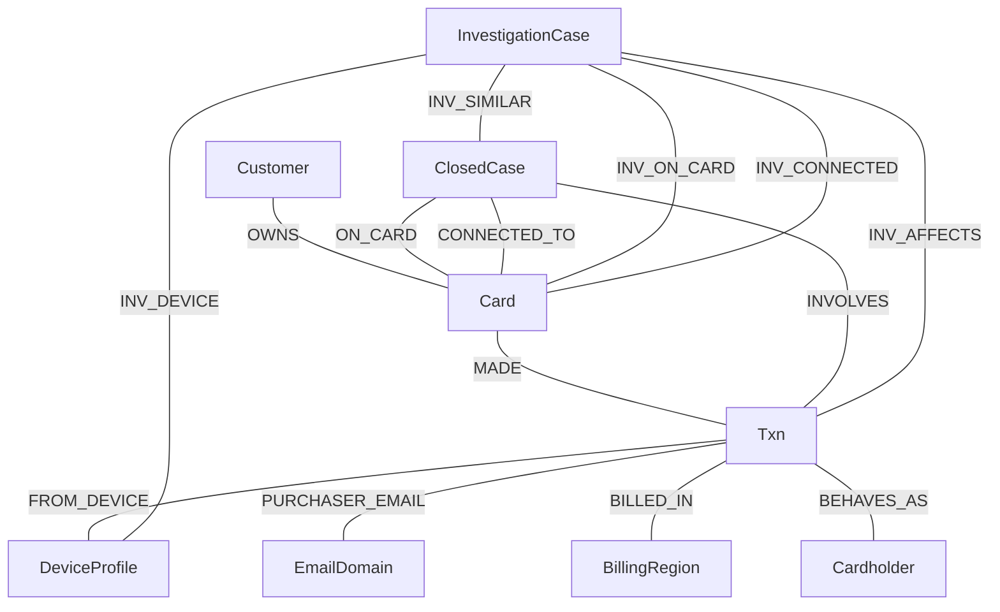

# Schema design — FraudGraph

The graph in `graph/schema.gsql`: **9 vertices, 14 undirected edges**, graph name `FraudGraph`.

Every vertex and edge exists to answer a question an investigator actually asks. Nothing is modelled "because the
data has a column for it" — see [What we did not model](#roadmap-entities-we-did-not-model-and-why).

Edges are **undirected** throughout. An investigation traverses both ways — from a card to its transactions and from
a device back to every card that touched it — and undirected edges halve the query count.

---

## Vertices

| Vertex | What it is | Investigation question it answers |
|---|---|---|
| `Customer` | the bank's customer record (13,553) | *Which cards does this account hold?* Entry point when a case cites a customer rather than a card. |
| `Card` | one payment card, keyed `card_id` (14,317) | *What is this card's normal behaviour, and what else is it connected to?* The primary subject of almost every case. |
| `Txn` | one transaction (590,742) | *What exactly happened, when, for how much, on what channel?* Carries the attributes every evidence line cites. |
| `DeviceProfile` | `DeviceInfo \| OS \| browser \| screen` (9,706) | *Who else used this device?* The shared-origin link that turns one case into a ring. |
| `EmailDomain` | purchaser email domain (59) | *Is this a throwaway domain, and does it recur across the suspect set?* |
| `BillingRegion` | `addr1` billing region (332) | *Has this card ever been used in this region before?* Backs the out-of-region detector. |
| `Cardholder` | the real person, keyed `uid` (202,440) | *Is this normal **for this person**?* Without it the baseline averages up to 3,789 unrelated people — see DATA_DICTIONARY §3.3. |
| `ClosedCase` | an investigation the bank already closed (5,565) | *Has the bank seen this before, and what did it conclude?* The GraphRAG retrieval corpus. |
| `InvestigationCase` | a case **our agent** closed | *What did we decide last time?* Written back so later cases can retrieve it. This is the case memory. |

`Txn` deliberately denormalises `card_id`, `customer_id`, `device` and `uid` as attributes as well as edges, so a
query can filter without a traversal.

## Edges

| Edge | From → To | What it means / what it answers |
|---|---|---|
| `OWNS` | Customer → Card | which cards belong to an account; the blast radius of BLOCK_ALL_CARDS |
| `MADE` | Card → Txn | the card's transaction history — the spine of every investigation |
| `FROM_DEVICE` | Txn → DeviceProfile | which device made this payment; the hop into ring detection |
| `PURCHASER_EMAIL` | Txn → EmailDomain | email domain reuse across a suspect set |
| `BILLED_IN` | Txn → BillingRegion | geographic footprint; is this region new for the card? |
| `BEHAVES_AS` | Txn → Cardholder | ties a payment to the real person, giving a per-cardholder baseline |
| `INVOLVES` | ClosedCase → Txn | which transactions a past case covered — lets us check whether a transaction is already adjudicated |
| `ON_CARD` | ClosedCase → Card | the card a past case was opened against; prior history on this card |
| `CONNECTED_TO` | ClosedCase → Card | cards a past case found *connected* but did not open against — how known rings are recorded |
| `INV_ON_CARD` | InvestigationCase → Card | the card our agent investigated |
| `INV_AFFECTS` | InvestigationCase → Txn | the transactions our agent judged fraudulent |
| `INV_CONNECTED` | InvestigationCase → Card | cards our agent found connected |
| `INV_DEVICE` | InvestigationCase → DeviceProfile | the device our agent implicated |
| `INV_SIMILAR` | InvestigationCase → ClosedCase | the prior cases our agent cited — the audit trail for a retrieval-grounded decision |

The five `INV_*` edges mirror the four `ClosedCase` edges on purpose: once written, our own cases are retrievable by
exactly the same queries that read the bank's history. Case memory is not a separate store.

---

## Diagram

The two-hop path that finds a ring is `Card → MADE → Txn → FROM_DEVICE → DeviceProfile` and back out to every other
`Txn`/`Card` on that device. The path that grounds a decision in precedent is
`Card → ON_CARD → ClosedCase` and `Txn → INVOLVES → ClosedCase`.

---

## Roadmap entities we did NOT model, and why

The original roadmap proposed Merchant, Account and IP vertices. **None of the three exists in this dataset.** The
IEEE-CIS data has no merchant name, no account number and no IP address — and inventing them would mean fabricating
evidence, which is worse than having a smaller graph.

| Proposed | Why not | What plays that role here |
|---|---|---|
| **Merchant** | No merchant field of any kind. `ProductCD` (5 values: W/C/R/H/S) is a product class, not a seller. | `ProductCD` as a `Txn` attribute, plus `EmailDomain` where the purchase is online. Neither identifies a seller, so no evidence line ever claims one. |
| **Account** | No account number. `customer_id` looks like one but is an aggregate covering up to 3,789 distinct people (DATA_DICTIONARY §3.3). | `Customer` for the bank-side record and `Cardholder` (`uid`) for the actual person. Splitting these is what makes per-person baselines meaningful. |
| **IP** | No IP address column. | `DeviceProfile` for the machine fingerprint, `BillingRegion` (`addr1`) for geography, and `id_23` for proxy type — the one signal that reveals a hidden/anonymous connection. |

Modelling all three would have added 3 vertices and ~5 edges that are null for 100% of rows.

---

## Undocumented patterns found so far

`closed_cases_history.csv` labels **9** cases `pattern = undocumented` — typologies the bank's own taxonomy has no
name for. Both clusters are reproduced by our detectors.

### Sub-$500 structuring — 5 cases
`CC-3748`, `CC-3841`, `CC-3907`, `CC-4086`, `CC-4124`. Four online purchases inside ~40 minutes, each just under
\$500, exposures clustered tightly at \$1,871–\$1,923. The amounts are chosen to sit under a \$500 authorization
threshold.

**Detected in [`agent/detectors.py:47`](../agent/detectors.py#L47), `structuring()`** — online channel, amount in
[400, 500), several within a short window. Emits signal `structuring_under_500` with `pattern='undocumented'`.

### Proxy / same-amount device rings — 4 cases
`CC-2649`, `CC-2971`, `CC-2985`, `CC-3035`. All four are purchases from a **Samsung SM-G935F on Chrome for Android
behind an anonymous proxy**, hitting different cardholders. Smaller exposures, \$108–\$390.

**Detected in [`agent/detectors.py:81`](../agent/detectors.py#L81), `device_ring()`** — one device across many cards,
classified `pattern='undocumented'` when ≥80% of the ring sits behind an anonymous/hidden proxy **or** ≥3 transactions
cluster on the same amount ([`detectors.py:115`](../agent/detectors.py#L115)). A ring of plain new-device purchases
without either marker stays `card_not_present_new_device` under R6 — the undocumented label is reserved for the
signature that matches no published typology.

Both rely on `id_23` (proxy type, 99.10% null) and `device_profile` (75.55% null). They fire on the minority of rows
that carry identity data; absence of a device row is never treated as evidence of innocence.
